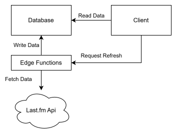

# Music Journey

Music Journey is a web app developed by [Benno Steinkamp](mailto:benno.steinkamp@study.hs-duesseldorf.de) that allows the User to explore their music listening history based on [last.fm](https://www.last.fm/home) stats. It can be tried out at https://wynotrepax.github.io/music-journey/.


## Technologies Used

Music Journey uses [Deno](https://deno.com/) as a package manager and for build orchestration. Deno is also used to execute the edge functions. The Web-client is based on [React](https://react.dev/) and is build using [Vite](https://vite.dev/). The Charts displayed are rendered using the [Chart.js](https://www.chartjs.org/) library using `react-chartjs-2` for react compatability.

The App uses [supabase](https://supabase.com/) for database and edge function hosting. The database itself is a [PostgreSQL](https://www.postgresql.org/) database.

The Demo is hosted on [GitHub pages](https://docs.github.com/de/pages).

## Development setup
### Prerequisites
* [Deno](https://deno.com/) 
  * To execute and install dependencies
* [Docker](https://www.docker.com/) 
  * To host supabase images for development

### Setup environment

1. Install the dependencies using deno:
    ```sh
    deno install
    ```

2. Create a `.env.local` in the `supabase/functions` directory. A Last.fm api key to be used during development needs to be provided here.

    ```
    LASTFM_API_KEY=<<Your Api key here>>
    ```

3. Start the supabase development containers
    ```sh
    deno task supabase start
    ```

4. Update supabase url and public key in the `/.env.local`, these can be found in the dashboard of the local supabase studio, its port should have been mentioned during the previous command. Otherwise look for a running docker container named `supabase_studio_music-journey`.
    > [!TIP]
    > The default port for the supabase instance is `54323`. The values can therefore be found at `http://localhost:54323/project/default`

5. Start the vite dev server
    ```sh
    deno task dev-client
    ```

## Project Structure
* `.vscode`
  * Contains Visual Studio Code settings
* `docs`
  * Additional documentation and images used in this README
* `lastfm`
  * Partial last.fm api client, only the methods needed for this project are implemented
* `scripts`
  * Scripts used during development
  * Specifically a script that allows loading initial data, for more information see limitations
* `shared`
  * Shared code that is used by both the client and the edge functions
* `src`
  * The source code for the client
* `supabase`
  * Supabase directory
* `supabase/functions`
  * The edge functions for data fetching
* `supabase/migrations`
  * Database migrations
* `supabase/snippets`
  * Database snippets
* `.env.local`
  * `.env` file containing environment variables used during development
* `deno.json`
  * Root deno configuration
* `README.md`
  * This readme
* `tsconfig.json`
  * Typescript configuration for the client
* `vite.config.ts`
  * Vite configuration

## Project Architecture

Since last.fm does not allow [CORS](https://de.wikipedia.org/wiki/Cross-Origin_Resource_Sharing) (and leaking your last.fm api key is a bad idea) edge functions are needed to request data from the last.fm api. The Database is also read-only for the public. This is fine since the only data exposed is already public via the last.fm api. All writing operations are handled by the edge functions.



## Limitations
This project has some known limitations. Potential fixes are included where I could think of them.

### Last.fm rate limit
Last.fm does not provide strict ratelimits for its apis. It does however state in its api [terms of service](https://www.last.fm/api/tos#4.4) that rate limits are enforced. To be caucious this application uses a quite conservative rate limit of one second. This is not a problem for requesting a specific users plays since those are paginated with page size 50 so about 3000 plays can be fetched within a minute. The problem is initialy fetching the tags for artists and tracks. The User used to test this application 'Gnedby' has at time of writing 4250 scrobbles or plays from 842 artists. For each artist and track the application sees for the first time those tags need to be fetched and the last.fm api does not provide a api for doing so in bulk. This leads to the edge function call taking a very long time and eventually timing out. This is mitigated by the fact that the plays of an individual user are not fully refreshed on each call but instead are only refreshed until already fetched plays show up. In the same manner tags are only fetched for artists and tracks for which this hasn't already happened, so repeating the refresh call will eventually complete. It can be assumed that listening behaviour broadly follows the [Pareto principle](https://en.wikipedia.org/wiki/Pareto_principle) and therefore most plays will be from a small fraction of all artists and tracks. This means this problem will be less noticeable the longer the application runs.

A second limitation is that, currently the rate limit is only enforced on a per request basis, which means it is possible to exhaust the last.fm ratelimit by requesting user refresh multiple times.

### Time Zones
Currently the database assumes the `Europe/Berlin` timezone for bucketing of the data, this means each play will be bucketed according to the day, week or month in that timezone. Since the client uses the users local timezone for processing this breaks the site if the users timezone is not `Europe/Berlin`. To fix this the database needs to know the users timezone this is possible by inserting a row containing the timezone for the current session and joining that into the view. This was not implemented due to time constraints.

### Album Tags
Currently only Tags on tracks and albums are used to generate the top tags reports. Album tags could additionally be used. This was not implemented due to time constraints.

## AI Usage Disclosure

During development [GitHub Copilot](https://github.com/features/copilot?locale=de-de) was used to generate some code. Mainly the [inline suggestions](https://code.visualstudio.com/docs/editing/ai-powered-suggestions) where used to speed up development. It was also used to isolate and fix bugs during development. All Documentation was written without the use of generative AI.